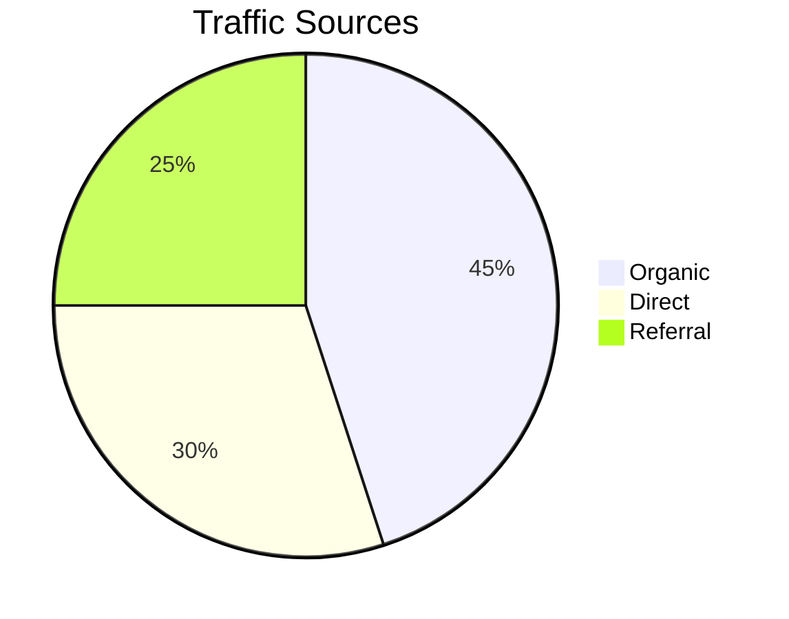
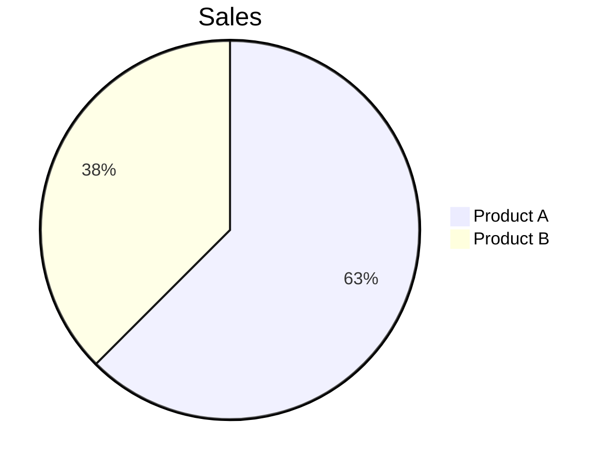
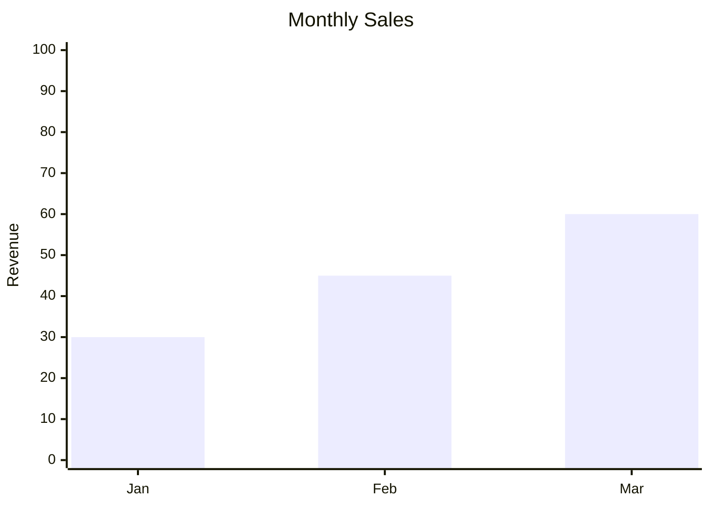
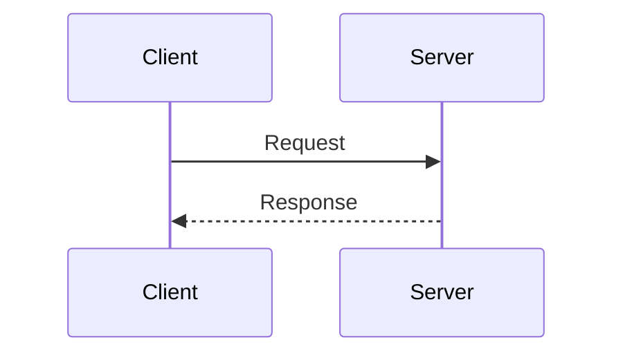

# Troubleshooting & Mermaid Diagrams

## Troubleshooting

**Port in use**: Server auto-increments to next available port (3456-3500)

**Images not loading**: Ensure image paths are relative to markdown file

**Server won't stop**: Check `/tmp/md-novel-viewer-*.pid` for stale PID files

**Remote access denied**: Use `--host 0.0.0.0` to bind to all interfaces

## Mermaid.js Diagrams

### Usage

Use fenced code blocks with `mermaid` language:

````markdown

````

### Supported Diagram Types

| Type | Syntax | Use Case |
|------|--------|----------|
| Flowchart | `flowchart LR/TB/TD` | Process flows, decision trees |
| Sequence | `sequenceDiagram` | API interactions, message flows |
| Pie | `pie title "..."` | Distribution data |
| Gantt | `gantt` | Project timelines |
| XY Chart | `xychart-beta` | Bar/line charts |
| Mindmap | `mindmap` | Idea hierarchies |
| Quadrant | `quadrantChart` | 2x2 matrices |

### Validating Mermaid Snippets

**Quick validation**: Use the [Mermaid Live Editor](https://mermaid.live) to test syntax.

**Common errors and fixes**:

| Error | Cause | Fix |
|-------|-------|-----|
| `Parse error` | Invalid syntax | Check diagram type declaration |
| `Unknown diagram type` | Typo in declaration | Use exact type: `flowchart`, not `flow` |
| `Expecting token` | Missing quotes/brackets | Ensure balanced delimiters |
| `UnknownDiagramError` | Empty or malformed block | Add valid diagram content |

### Fixing Common Issues

**1. Flowchart arrows**


**2. Pie chart values**


**3. XY Chart data format**


**4. Sequence diagram participants**


### Debug Mode

When a diagram fails to render, the viewer shows:
- Error message
- Expandable source code preview
- Line number where parsing failed (when available)

Fix the syntax and refresh the page to re-render.
