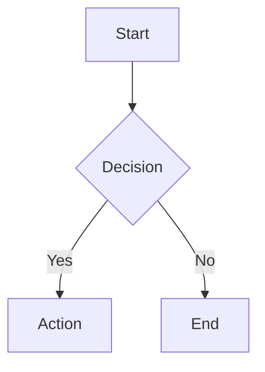

# hs:mermaidjs — diagrams with Mermaid.js v11

Create text-based diagrams using Mermaid.js v11 syntax. Primary path: write a ` ```mermaid ` block in markdown -- renders immediately on GitHub, GitLab, Obsidian, VS Code, no installation needed. Image export (SVG/PNG/PDF) is OPTIONAL via the `mmdc` CLI.

## Diagram types

| Type | Use when | Reference |
|---|---|---|
| `flowchart` | process, decision tree | `references/diagram-types.md` |
| `sequenceDiagram` | API flow, actor interaction | `references/diagram-types.md` |
| `classDiagram` | OOP, data model | `references/diagram-types.md` |
| `stateDiagram-v2` | state machine, workflow | `references/diagram-types.md` |
| `erDiagram` | database schema | `references/diagram-types.md` |
| `gantt` | sprint/project timeline | `references/diagram-types.md` |
| `architecture-beta` | cloud infra, services | `references/diagram-types.md` |
| `gitGraph` | branching strategy | `references/diagram-types.md` |
| `journey` | user experience flow | `references/diagram-types.md` |

Full 24+ types and detailed syntax: `references/diagram-types.md`.

## Primary path -- inline markdown (zero deps)

````markdown

````

**Config via frontmatter** (diagram-level):

````markdown

````

Theme options: `default`, `dark`, `forest`, `neutral`, `base`.

**Comment:** prefix ` %% ` for single-line comments.

## Optional path -- export images with mmdc

> Only needed when a SVG/PNG/PDF file is required. Not a hard dependency.

```bash
# Install (requires Node.js >=18)
npm install -g @mermaid-js/mermaid-cli

# Export
mmdc -i diagram.mmd -o diagram.svg
mmdc -i diagram.mmd -o diagram.png -t dark -b transparent
mmdc -i diagram.mmd -o diagram.pdf

# Use without installing
npx -p @mermaid-js/mermaid-cli mmdc -i diagram.mmd -o diagram.svg
```

Batch, Docker, config file details: `references/cli-export.md`.

## Boundaries and cross-references

- **hs:tech-graph** -- when a publish-grade SVG with layout rules (spacing, anti-collision) is needed.
- **hs:preview** -- when you want to view the diagram in a browser before adding it to docs.
- **hs:docs** -- when the diagram is part of a document that needs updating.
- **hs:drawio** -- branded stencils (AWS/Azure/GCP/Cisco/K8s/UML/ER), strict geometry, editable export, offline preview; prefer for vendor-specific shapes or draw.io-native editing.
- Mermaid is the right choice for inline docs/markdown diagrams; for an editable canvas see hs:excalidraw.

## Configuration

Theming, ARIA/WCAG accessibility, icon packs, KaTeX math, security levels, and layout algorithms: `references/configuration.md`.

## Quick examples

See `references/examples.md` for real-world patterns:
- Microservices architecture
- Auth sequence flow
- E-commerce ER schema
- Order state machine
- Sprint Gantt
- CI/CD pipeline
- Git branching
