# Mermaid.js v11 -- Practical examples

Practical patterns for common documentation scenarios.

## Software Architecture

**Microservices:**
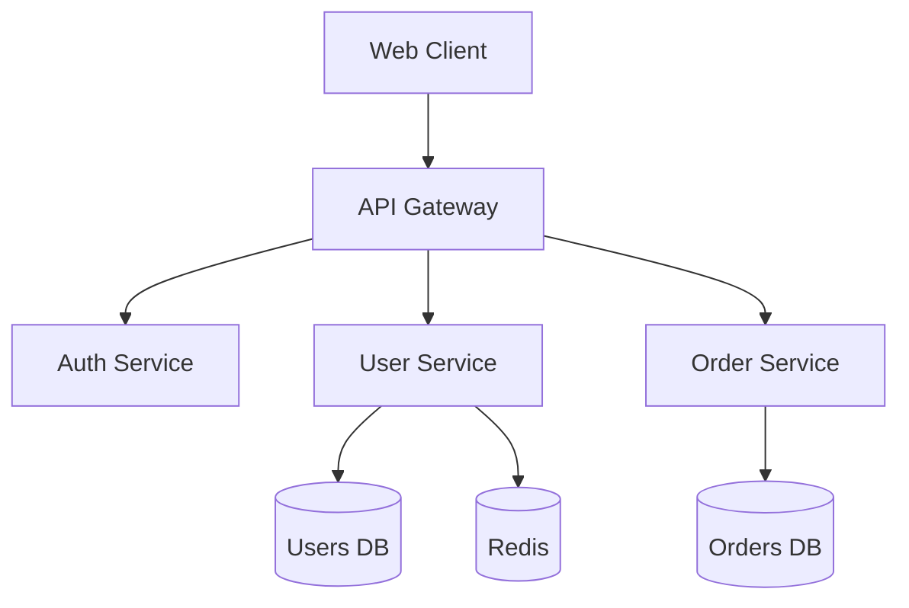

**C4 System Context:**
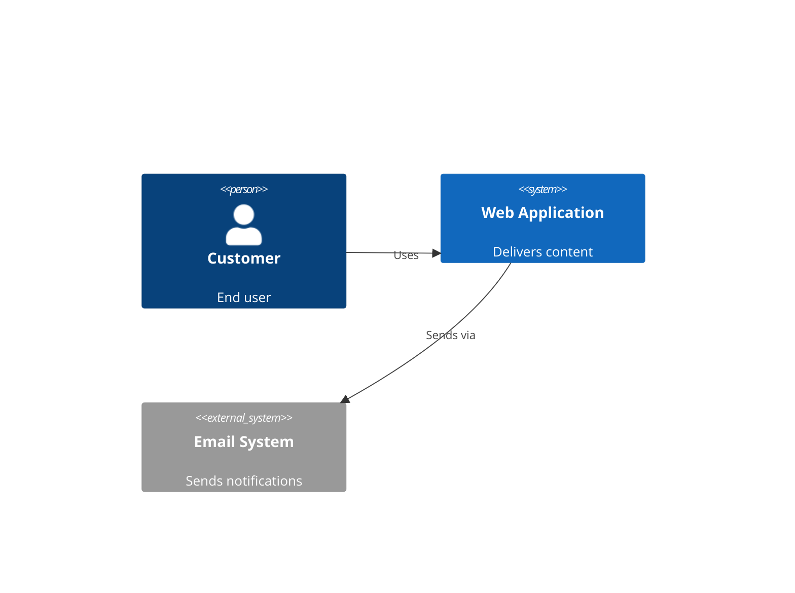

**Cloud Infrastructure:**
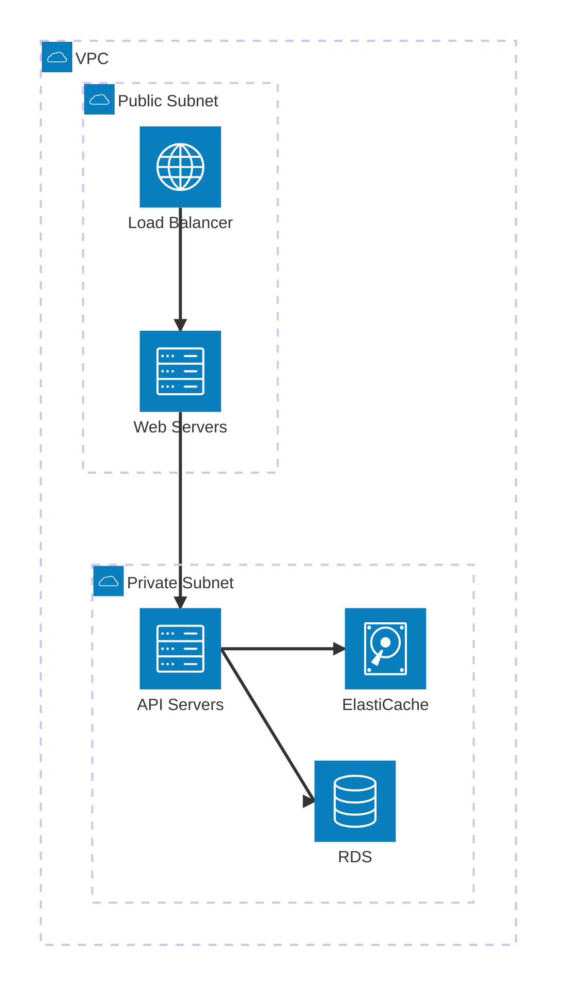

## API Documentation

**Authentication Flow:**
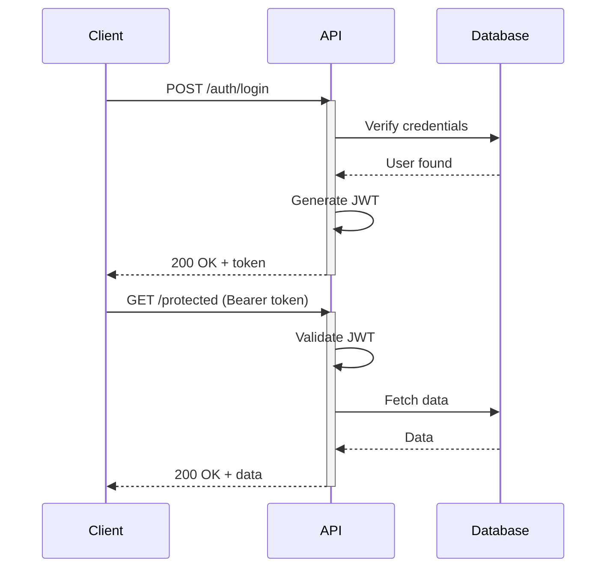

**REST Endpoint Map:**
```mermaid
flowchart LR
  API[API]
  Users[/users]
  Posts[/posts]

  API --> Users
  API --> Posts

  Users --> U1[GET /users]
  Users --> U2[POST /users]
  Users --> U3[GET /users/:id]
  Users --> U4[PUT /users/:id]
  Users --> U5[DELETE /users/:id]
```

## Database Design

**E-Commerce Schema:**
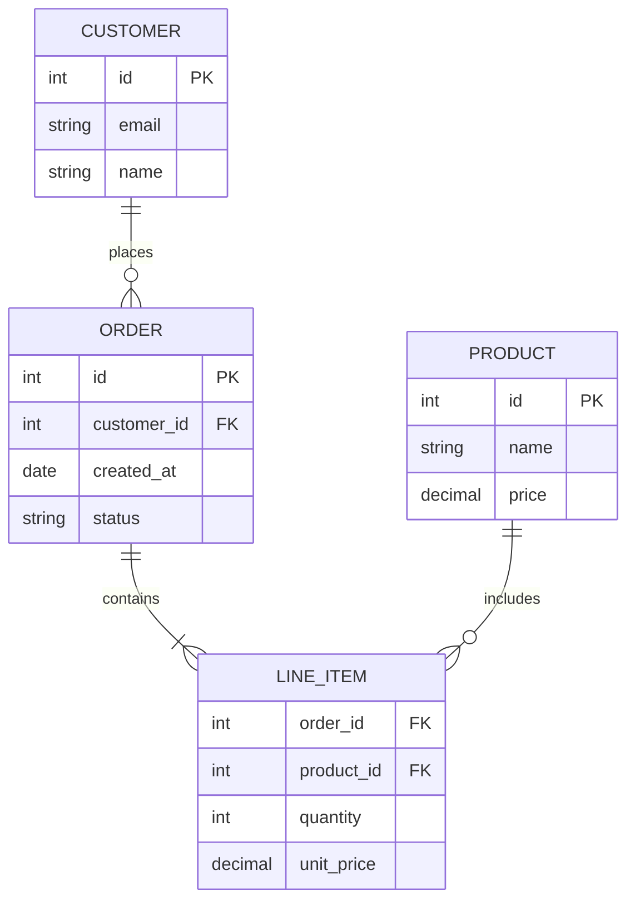

## State Machines

**Order Processing:**
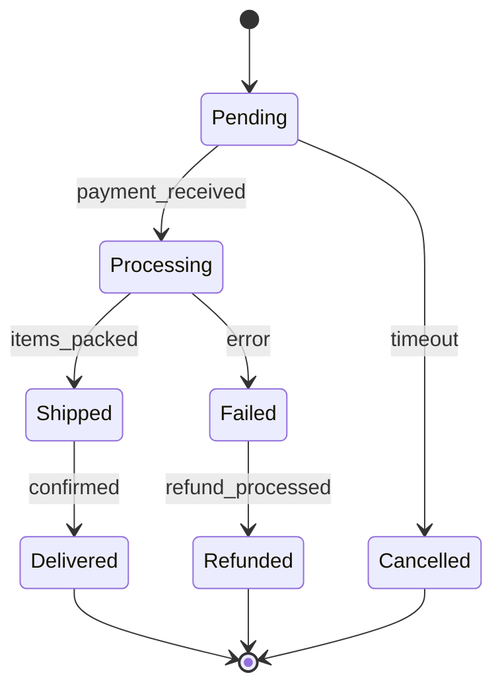

**Auth States:**
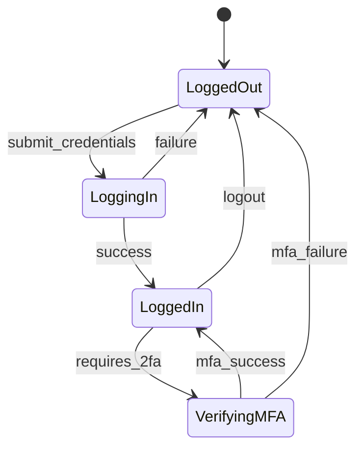

## Project Planning

**Sprint Timeline:**
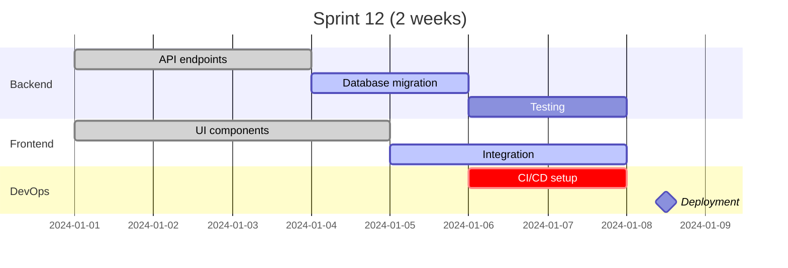

## Object-Oriented Design

**Payment System:**
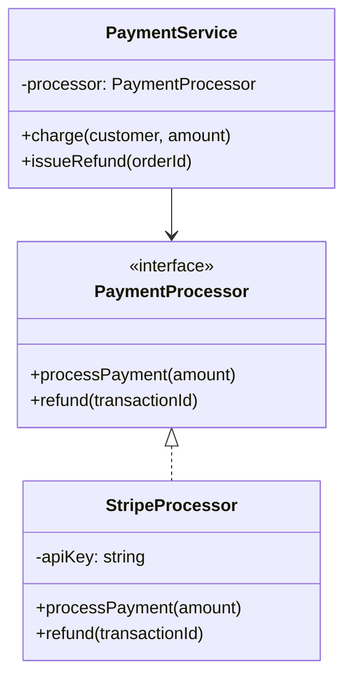

## CI/CD Pipeline

**Deployment Flow:**
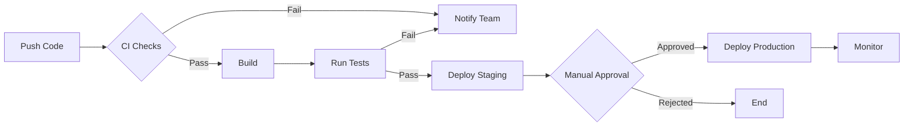

**Git Branching Strategy:**
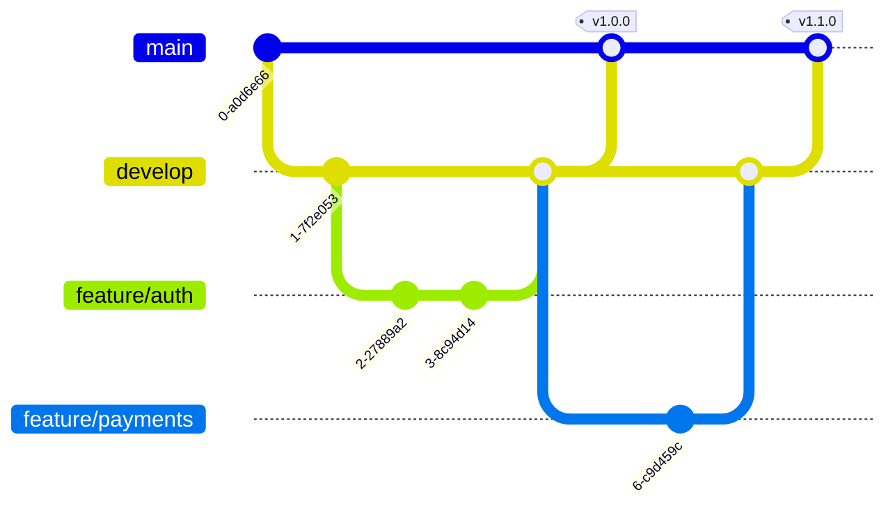

## Data Visualization

**Traffic Sources (Pie):**
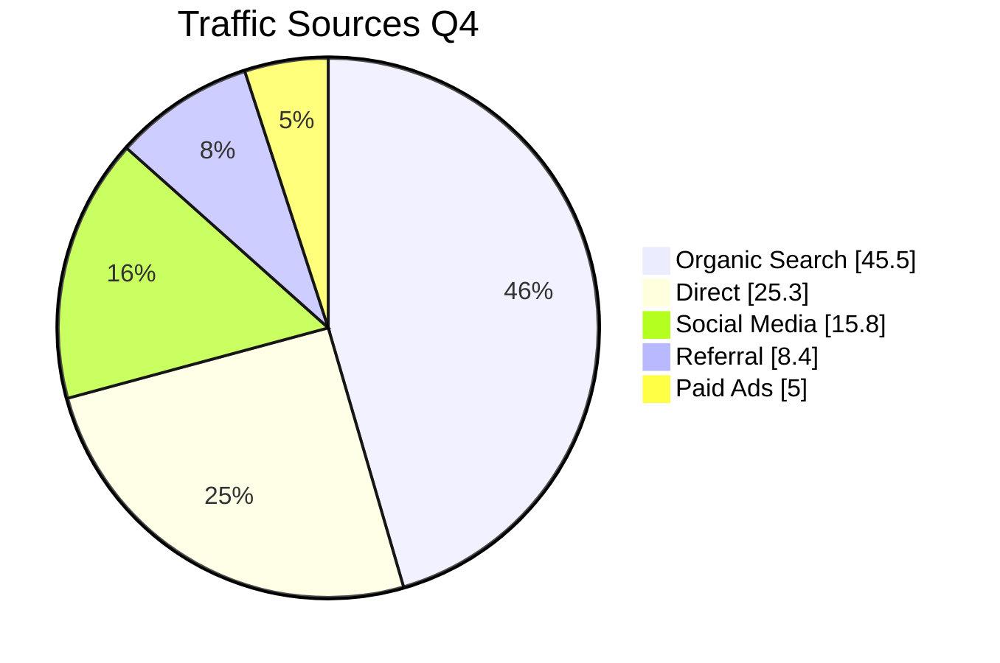

**Team Skills (Radar):**
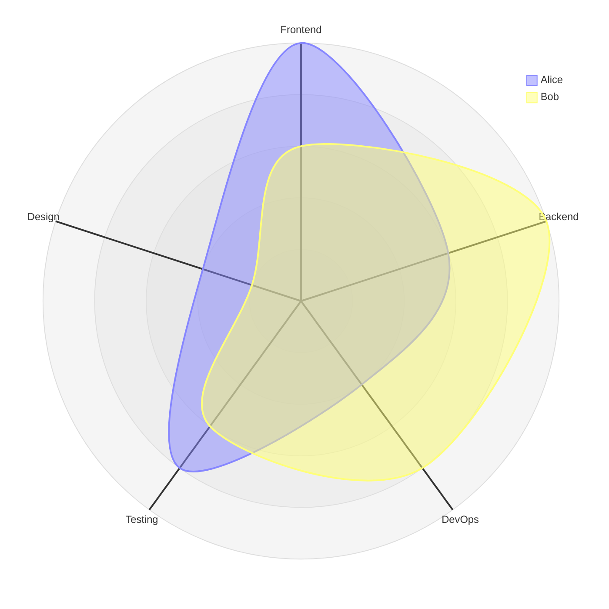

## Styling Tips

**Per-diagram theme via frontmatter:**
````markdown

````

**Inline init block** (highest priority, overrides global):
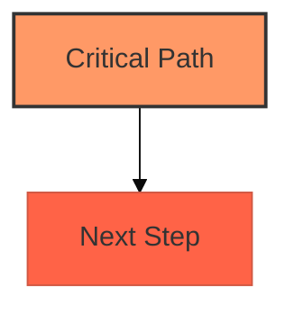

**Naming conventions:**
- Descriptive node IDs: `userService` not `A`
- Clear labels: `[User Service]` not `[US]`
- Labelled edges: `-->|authenticates|` not `-->`
- Security: use `securityLevel: 'strict'` for user-generated diagrams (prevents XSS)
