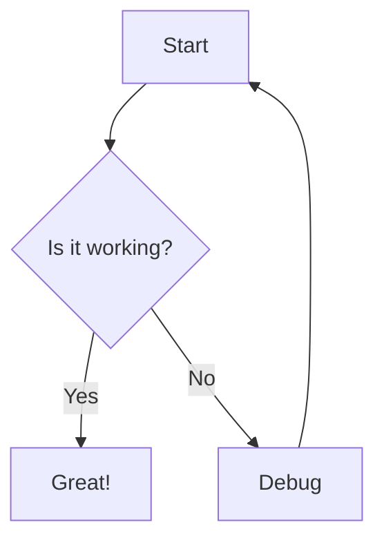
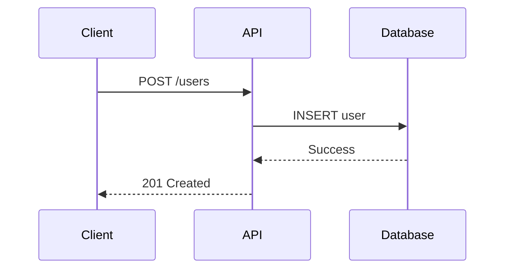

# MDX Components Reference (continued 2/3)

## Document API

### ParamField

Document API parameters with type information.

```mdx
<ParamField path="id" type="string" required>
  Unique identifier for the resource
</ParamField>

<ParamField query="page" type="number" default="1">
  Page number for pagination
</ParamField>

<ParamField body="email" type="string" required>
  User's email address
</ParamField>

<ParamField header="Authorization" type="string" required>
  Bearer token for authentication
</ParamField>
```

**Attributes:**
- `path` / `query` / `body` / `header` - Parameter location
- `type` - Data type (string, number, boolean, object, array)
- `required` - Mark as required parameter
- `default` - Default value if not provided
- `enum` - Array of allowed values
- `enumDescriptions` - Descriptions for enum values

**With enum:**

```mdx
<ParamField
  body="status"
  type="string"
  enum={["active", "inactive", "pending"]}
  enumDescriptions={{
    active: "User is active and can access the system",
    inactive: "User account is disabled",
    pending: "User registration pending approval"
  }}
>
  Account status
</ParamField>
```

### ResponseField

Document API response fields.

```mdx
<ResponseField name="id" type="string" required>
  Unique identifier of the created resource
</ResponseField>

<ResponseField name="email" type="string">
  User's email address
</ResponseField>

<ResponseField name="created_at" type="timestamp">
  ISO 8601 timestamp of creation
</ResponseField>
```

**Nested responses:**

```mdx
<ResponseField name="user" type="object">
  User information

  <Expandable title="user properties">
    <ResponseField name="id" type="string">
      User ID
    </ResponseField>
    <ResponseField name="name" type="string">
      Full name
    </ResponseField>
  </Expandable>
</ResponseField>
```

### RequestExample

Show example API requests in multiple languages.

```mdx
<RequestExample>
```bash cURL
curl -X POST https://api.example.com/users \
  -H "Authorization: Bearer YOUR_TOKEN" \
  -H "Content-Type: application/json" \
  -d '{"email": "user@example.com"}'
```

```python Python
import requests

response = requests.post(
    "https://api.example.com/users",
    headers={"Authorization": "Bearer YOUR_TOKEN"},
    json={"email": "user@example.com"}
)
```

```javascript JavaScript
fetch("https://api.example.com/users", {
  method: "POST",
  headers: {
    "Authorization": "Bearer YOUR_TOKEN",
    "Content-Type": "application/json"
  },
  body: JSON.stringify({ email: "user@example.com" })
})
```
</RequestExample>
```

### ResponseExample

Show example API responses.

```mdx
<ResponseExample>
```json Success Response
{
  "id": "usr_123",
  "email": "user@example.com",
  "created_at": "2024-01-15T10:30:00Z"
}
```

```json Error Response
{
  "error": {
    "code": "invalid_email",
    "message": "The provided email address is invalid"
  }
}
```
</ResponseExample>
```

## Link Pages

### Cards

Create clickable cards that link to other pages.

```mdx
<CardGroup cols={2}>
  <Card title="Getting Started" icon="rocket" href="/docs/quickstart">
    Quick introduction to get up and running
  </Card>
  <Card title="API Reference" icon="code" href="/api/overview">
    Complete API documentation
  </Card>
  <Card title="Guides" icon="book" href="/guides">
    Step-by-step tutorials and guides
  </Card>
  <Card title="Examples" icon="lightbulb" href="/examples">
    Real-world implementation examples
  </Card>
</CardGroup>
```

**Attributes:**
- `title` - Card title
- `icon` - Icon name (Font Awesome or Lucide)
- `href` - Link destination
- `color` - Card accent color

**CardGroup attributes:**
- `cols` - Number of columns (1-4)

### Tiles

Compact tile layout for links.

```mdx
<TileGroup>
  <Tile title="Installation" href="/docs/installation" icon="download" />
  <Tile title="Configuration" href="/docs/config" icon="settings" />
  <Tile title="Deployment" href="/docs/deploy" icon="rocket" />
  <Tile title="Troubleshooting" href="/docs/troubleshoot" icon="wrench" />
</TileGroup>
```

## Visual Context

### Icons

Display icons inline using Font Awesome or Lucide.

```mdx
<Icon icon="rocket" size={24} />
<Icon icon="check-circle" color="green" />
<Icon icon="warning" iconType="solid" />
```

**Attributes:**
- `icon` - Icon name
- `size` - Icon size in pixels
- `color` - Icon color
- `iconType` - Icon style (solid, regular, light, duotone)

### Mermaid Diagrams

Create diagrams using Mermaid syntax.

````mdx

````

**Supported diagram types:**
- Flowcharts
- Sequence diagrams
- Class diagrams
- State diagrams
- Entity relationship diagrams
- Gantt charts
- Pie charts
- Git graphs

**Sequence diagram example:**

````mdx

````

### Color

Display color swatches with hex values.

```mdx
<Color color="#0D9373" name="Primary" />
<Color color="#55D799" name="Light" />
<Color color="#007A5A" name="Dark" />
```

### Tree

Display file tree structures.

```mdx
<Tree>
  <Folder name="src">
    <Folder name="components">
      <File name="Button.tsx" />
      <File name="Input.tsx" />
    </Folder>
    <Folder name="utils">
      <File name="api.ts" />
      <File name="helpers.ts" />
    </Folder>
    <File name="index.ts" />
  </Folder>
  <File name="package.json" />
  <File name="tsconfig.json" />
</Tree>
```


---

Continued in [mdx-components-reference-cont2.md](mdx-components-reference-cont2.md)
