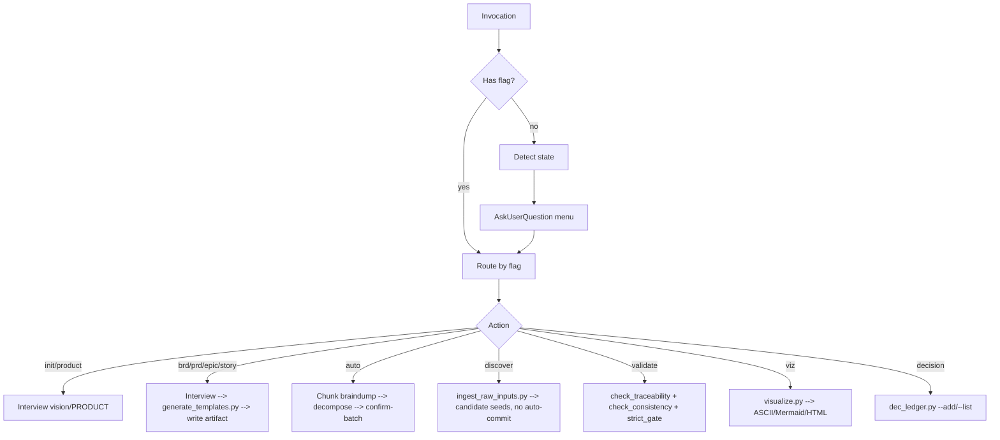

# hs:spec — PO-facing product spec hierarchy

Product-Owner-facing skill for building and maintaining a strictly-traceable spec hierarchy: **Vision → 1
BRD → many PRDs → Epics → Stories (+AC)**. Drives a phased PO interview (bilingual EN/VI), persists
artifacts as markdown with rich YAML frontmatter under `docs/product/`, validates structure
deterministically plus LLM judgment, and visualizes the spec tree in ASCII, Mermaid, and self-contained
HTML.

`hs:spec` is the PO half of the product pair — `hs:shape` (BA) bridges PO stories to dev tasks; it never
speaks to the market itself. The two skills never mutate each other's artifacts.

## When to Use

- A product owner needs to capture a new product (vision → stories) without writing code.
- An existing spec needs a new BRD/PRD/Epic/Story or a delta of stories under an epic.
- A PO has a brain-dump that needs decomposing into the canonical hierarchy.
- A spec needs validation (orphans, missing AC, INVEST quality, core-value drift, contradiction).
- A spec needs visualizing (traceability tree, roadmap, MoSCoW, gap-analysis, …).

## Flags

| Flag | Purpose |
|---|---|
| (no flag) | Detect state → present menu (init / new BRD / new PRD / add stories / validate / visualize / decision). |
| `--product` | Init/refresh `PRODUCT.md` (thin product-context labels). |
| `--brd` | Create/refine the single BRD. |
| `--prd [feature]` | Create/refine a PRD (feature-area). Multi-PRD supported. |
| `--epic [prd]` | Create/refine an epic under the given PRD. |
| `--story [epic]` | Create/refine a story under the given epic. |
| `--auto` | Brain-dump → decompose into BRD goals / PRDs / epics / stories; confirm-batch on ambiguous splits. |
| `--discover <path(s)>` | Discovery seed: ingest raw upstream text (transcripts/notes — files+dirs, `.md`/`.txt`, read-fenced, size-capped) → **candidate** personas/problems/JTBD to seed the Vision/BRD interview. Never auto-commits — the interview confirms each. See `references/workflow-discover.md`. |
| `--validate [--strict]` | Run the structural check catalog + LLM judgment → human report; `--strict` makes errors block. See `references/validation-rules-spec.md`, `references/workflow-validate.md`. |
| `--viz <view> [--format ascii\|mermaid\|html] [--group-by <field>] [--filter-wont] [--layers <types>]` | Render a visualization (traceability tree, roadmap, MoSCoW, gap, risk, board, explorer, …). See `references/visualization-spec.md`. |
| `--decision [list\|ID]` | Per-workspace DEC ledger: view or record an explicit PO/BA ruling (`DEC-<n>`) in `docs/product/decisions.md` — authoritative home for ruled drift. See `references/dec-ledger.md`. |

Critique is not a flag of this skill — it routes through the general-purpose review engine:
`hs:critique <spec-artifact> --lenses spec-tech-critic,spec-craft-critic,product-value-critic,market-fit-critic`
(see `references/spec-critique.md`). `hs:spec` never runs a second critique engine.

## No-Flag Menu

When invoked without a flag, the skill inspects `docs/product/`:

- No `PRODUCT.md` → offer **Init product** (guided vision interview → write `PRODUCT.md` + `vision.md`),
  or **Discover-seed** (point at raw transcripts/notes → candidate personas/problems to seed the
  interview).
- `PRODUCT.md` exists → present an **AskUserQuestion** menu:
  1. New BRD / refine BRD
  2. New PRD (feature-area)
  3. Add stories under existing epic
  4. Validate spec (structural + judgment)
  5. Visualize (pick view + format)
  6. Record a decision (`--decision`)

## Output Contract (in the user's project)

All PO artifacts live under `docs/product/`. The skill never writes prose outside this tree — every
script-driven write is fenced through `scripts/fs_guard.py` (`assert_under_docs_product`).

```
docs/product/
├── PRODUCT.md                # thin product-context labels (DRY home for facts)
├── vision.md                 # narrative vision + personas + north-star
├── brd.md                    # single BRD (business goals + metrics + stakeholders)
├── prds/<slug>.md            # one PRD per feature-area
├── epics/<id>.md             # epics referenced from PRDs
├── stories/<id>.md           # stories referenced from epics, with AC
├── .session.md               # interview session state (committed; resumable)
├── decisions.md              # per-workspace DEC ledger: DEC-<n> rulings
└── visuals/                  # rendered visualizations (ASCII / Mermaid / HTML)
```

`hs:shape`'s BA sidecar (`docs/product/shape/`) is a separate tree this skill never writes to.

## Workflow Map



## Loads `references/*` on Demand

The lean skeleton above stays thin; full prose lives in `references/`, loaded only for the active flag:

- `references/document-model-and-hierarchy.md` — artifact roles, DRY rule, hierarchy diagram.
- `references/frontmatter-and-id-spec.md` — canonical YAML schema per artifact + the parent-scoped ID
  grammar (`BRD-G1`, `PRD-AUTH`, `PRD-AUTH-E1`, `PRD-AUTH-E1-S1`) — the SSOT is `scripts/id_grammar.py`.
- `references/guardrails-and-boundaries.md` — boundary: no code, no engineering estimation, hierarchy
  stops at Story.
- `references/interview-vision.md`, `interview-brd.md`, `interview-prd.md`, `interview-epic.md`,
  `interview-story.md`, `interview-frameworks.md` — bilingual EN/VI question banks + 5-Why / MoSCoW /
  story-mapping prompts. `--epic` loads `interview-epic.md`; `--story` loads `interview-story.md`
  (progressive disclosure — load only the one the flag needs).
- `references/workflow-interview.md` — end-to-end interview + generation flow (resume, adaptive
  skipping, Scope Challenge, MoSCoW gate, Validation Log) for `--product`/`--brd`/`--prd`/`--epic`/
  `--story` and the no-flag init flow.
- `references/workflow-auto.md` — `--auto` brain-dump decompose workflow.
- `references/workflow-discover.md` — `--discover` ingest workflow.
- `references/validation-rules-spec.md`, `references/workflow-validate.md` — `--validate` check catalog
  + invoke order.
- `references/visualization-spec.md` — `--viz` view catalog. `references/workflow-export.md` documents
  the read-once export design, but `--export` is **not shipped** in this build — see the caveat at the
  top of that file.
- `references/spec-critique.md` — how to route a spec artifact through `hs:critique --lenses`.
- `references/dec-ledger.md` — `--decision` allocation mechanism + the two-ledger distinction.

Load only the references relevant to the active flag. Skill resources (`scripts/`, `assets/templates/`)
sit alongside.

## Resources

- `scripts/` — Python stdlib (+ pyyaml where the parser needs it). Run via plain `python3 <script>.py`
  (no venv indirection — the harness ships its own interpreter). Each script accepts `--root
  <project-dir>` (default CWD) and emits JSON on stdout. All judgment lives in the LLM layer; scripts
  are structural-only.
  - `id_grammar.py`, `spec_graph.py`, `frontmatter_parser.py`, `encoding_utils.py` — document model.
  - `fs_guard.py` — the shared script-path containment helper: every script-driven write
    resolves through `assert_under_docs_product` before touching disk (raises on an escape attempt).
  - `check_fence.py` — the advisory pull-side companion to `fs_guard.py`: a git-porcelain-based
    soft-fence scanner that emits `fence_breach` findings for out-of-lane writes (advisory, never blocks).
  - `template_id_alloc.py` — parent-scoped ID allocation (`allocate_id`), grammar sourced from
    `id_grammar` (the SSOT), never re-encoded.
  - `generate_templates.py` — instantiates `assets/templates/*.md`, substitutes `{{token}}`s, drops
    unrequested `<!-- OPTIONAL: name --> ... <!-- /OPTIONAL -->` sections, refuses to mint an artifact
    with `status: approved` (new artifacts always start `draft`).
  - `ingest_raw_inputs.py` — `--discover`'s read-fence + filter (project-root fence, `.md`/`.txt`
    allow-list, dotfile exclusion, size cap, bounded directory recursion).
  - `open_questions.py` — scans the whole spec tree for PO-facing open-question markers (`cần PO xác
    định` / `TBD` / `vẫn còn mở`) so nothing unresolved silently rides inside an `approved` artifact.
  - `dec_ledger.py` — the per-workspace DEC ledger allocator.
  - `snapshot.py` — opt-in whole-tree backup/restore of `docs/product/`
    (`--snapshot` / `--restore <ts>` / `--list` / `--label` / `--confirm`). This
    is a filesystem backup engine, distinct from `spec_graph.py --snapshot`
    (which records a graph-JSON delta for the `--viz delta` view); the two share
    only the word "snapshot".
- `assets/templates/*.md` — markdown templates with `{{token}}` substitution: `product.md`, `vision.md`,
  `brd.md`, `prd.md`, `epic.md`, `story.md` (live, generated by shipped flags). `exec-summary.md` and
  `release-notes.md` are ALSO writable today via `generate_templates.py --type exec_summary|release_notes
  --write` (both carry an `OUTPUT_PATH_FOR_TYPE` mapping) — there is just no dedicated interview flag that
  auto-invokes them. `sign-off.md` is a registered `--type` choice with NO path mapping, so its `--write`
  is a content-only no-op (returns the rendered block, writes no file). `decision-record.md` (live for
  `--decision` — `dec_ledger.py` renders its own block inline; this
  file documents the shape only, `generate_templates.py` never substitutes into it).
  `change-log-entry.md`, `outcomes.md`, `impact-report.md` are **reserved,
  not-shipped** design references — `generate_templates.py` does not even register them as `--type`
  choices, and their backing writers (`change_log_writer.py` / `record_outcome.py` / the impact-pass)
  do not exist. See each template's own header comment for the caveat.

## Operating Principles

- **PO-facing.** No code in prose. No engineering jargon. Personas, value, scope, AC — in plain language.
- **Frontmatter is source-of-truth.** Scripts parse YAML; the LLM never infers structure from headings.
- **DRY.** One authoritative home per fact. Cross-reference by ID; do not duplicate prose.
- **Script vs LLM split.** Scripts: structural-only (parse, graph, orphan, AC-count, ID integrity). LLM:
  judgment (INVEST, vagueness, core-value drift, dup, contradiction).
- **No silent reversals.** A contradiction with an approved decision is surfaced; the PO chooses — the
  skill never auto-flips.
- **Never overwrite manual prose without `--force`.** `generate_templates.py` refuses to clobber an
  existing artifact unless the caller opts in.
- **Bilingual.** EN and VI interview banks; IDs and frontmatter keys stay English. VI phrasing is
  native-reviewed for natural wording.
- **Hierarchy stops at Story.** No story points, no engineering estimation — see
  `references/guardrails-and-boundaries.md`.

Deeper LLM operating guidance lives in `references/` (loaded on demand by flag).
